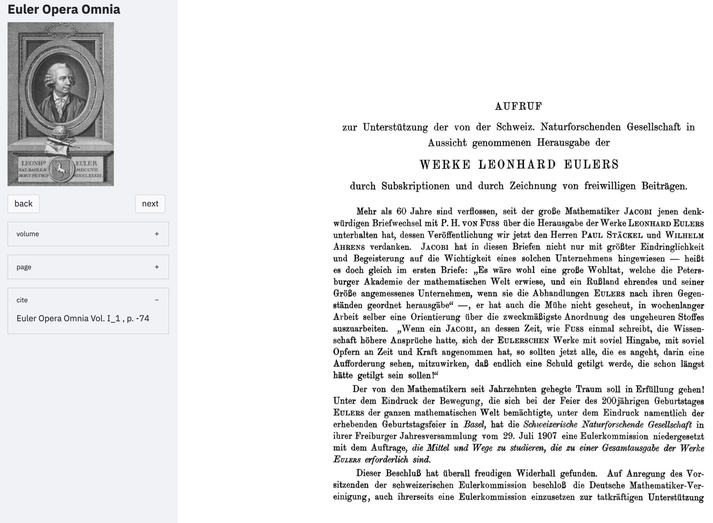

# Zitate, Zitieren, Verweise

## Zitieren der Euler Opera Omnia Bände

Alle Stellen aus dem Gesamtwerk Eulers können über die originale Paginierung zitiert werden. Grundlegend sind dabei zwei Bezugsquellen:

(1) Die Werke und Seiten der *Euler Opera Omnia*

(2) Werke und Seiten nach der ursprünglichen Quelle

## Zitieren mit Bibliographieprogrammen

## Zitieren über mit maschinenlesbare API

## Zitierfähige Seiten des gesamten Werks Eulers

