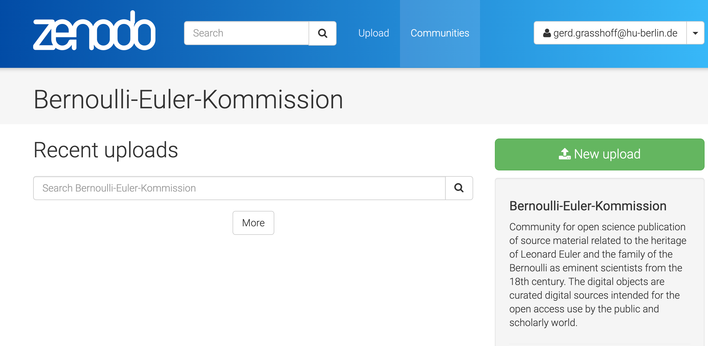

# Springer volumes Euler Opera Omnia

## Übersicht Phase 1, Zwischenstand 1 (17. Mai 2021)

1) Buchbestand zum Scannen angeliefert, geprüft und registriert.

   * Die Lieferung Springer von 69 Büchern in 9 Paketen ist in Berlin eingetroffen (12. Mai 2021), bearbeitet und an den Scanning Dienstleister zur Weiterverarbeitung versandt worden (17. Mai 2021).

2) Datenbank der Bände der Euler Opera Omnia erstellt.

   * [Datenbank EOO live](http://grasshoff.college/eulerOOtable){target=_blank}

3) Datenbank einer fehlerarmen Baseler Version des Enestroem Verzeichnisses auf der Basis von Goff in JSON übertragen und für die technischen Erfordernisse angepasst.

   * [Datenbank Baseler Enestroem Verzeichnis](http://grasshoff.college/eulerOOtable){target=_blank}

4) Zenodo Community eingerichtet.

  {: style="width:650px"}

5) Prototyp des *comp.Book* für Euler Opera Omnia angepasst und mit den Kernfunktion implementiert. Im Probebetrieb werden weitere Komponenten sukzessive hinzugefügt.

  

6) Webserver für die Euler OO mit belastungsfähige Zugriffszahlen entwickelt und eingerichtet.

7) Programmpakete zur Datenverwaltung in Python entwickelt .

8) Datenstruktur für das Dokumentenmanagement entwickelt.

9) Dokumentation Webseite auf Github eingerichtet.
